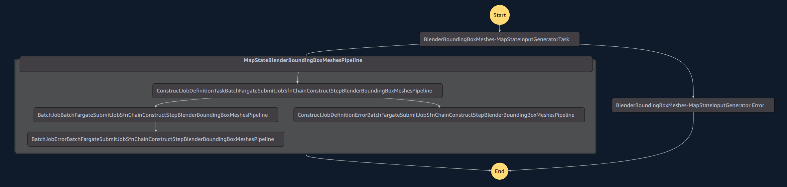
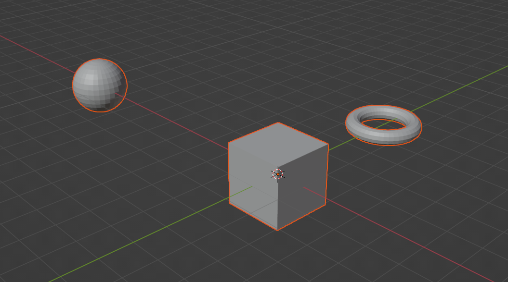
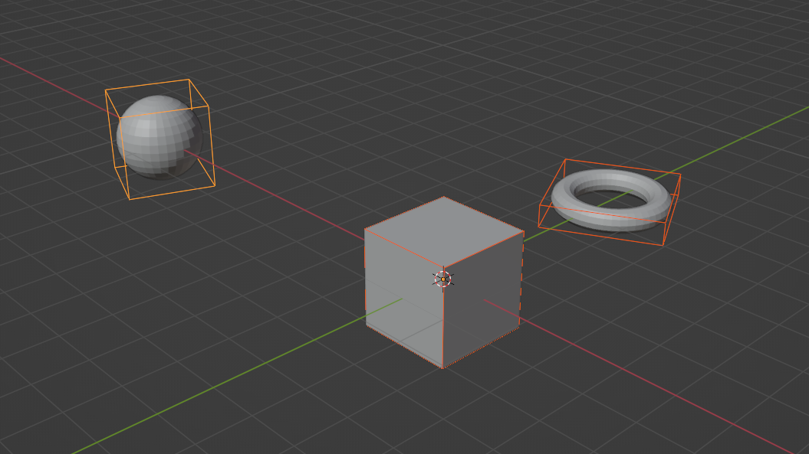
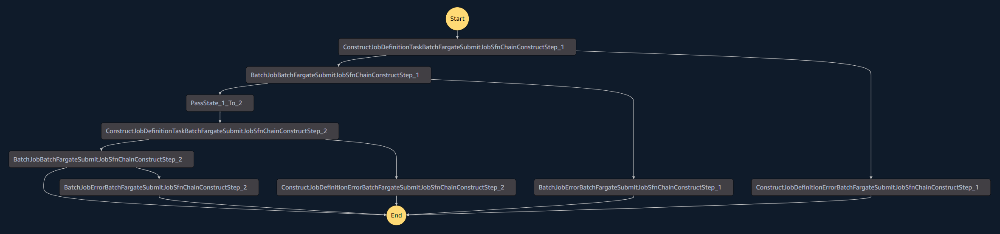
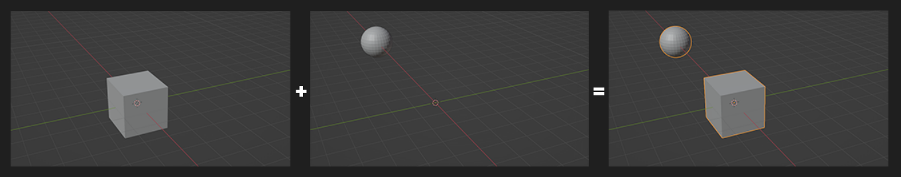
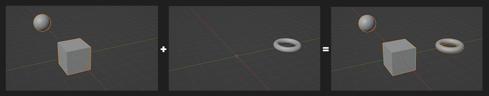

# CDK Sample - Data Transformation Pipeline

## Overview

This sample CDK project demonstrates how to deploy AWS data transformation pipelines using the constructs and patterns provided in this library. You can deploy one of two sample pipelines:

1. **[Blender Bounding Box Parallel Pipeline](../src/use-cases/blender/blender-boundingbox-meshes-parallel/README.md)** - Processes multiple 3D mesh files in parallel, calculating a bounding box for each mesh.
2. **[Blender Join Meshes Series Pipeline](../src/use-cases/blender/blender-join-meshes-series/README.md)** - Joins multiple 3D mesh files together in a series of sequential steps.

Both pipelines use AWS Batch with Fargate to process 3D mesh files using Blender, demonstrating how to build scalable data transformation workflows.

## Getting Started

Follow these steps to set up the required tools and deploy one of the sample pipelines to your AWS environment:

### Prerequisites

- An AWS account (we recommend using a new account for testing)
- [AWS CLI](https://aws.amazon.com/cli/) installed and configured
- Node.js v18.20.4 or later
- [AWS CDK](https://github.com/aws/aws-cdk/releases/tag/v2.187.0) v2.187.0 or later
- Docker installed and running (required for container image building)

### Configure AWS CLI

```bash
aws configure --profile [your-profile] 
AWS Access Key ID [None]: xxxxxx
AWS Secret Access Key [None]: yyyyyyyyyy
Default region name [None]: us-east-1 
Default output format [None]: json
```

### Deploy the Pipeline

1. Clone this repository
   ```bash
   git clone <repository-url>
   ```

2. Install dependencies from the project root
   ```bash
   npx projen install
   ```

3. Navigate to the CDK sample directory
   ```bash
   cd cdk-sample
   ```

4. Install packages
   ```bash
   npm install
   ```

5. Bootstrap AWS CDK resources in your account
   ```bash
   cdk bootstrap aws://ACCOUNT_ID/REGION
   ```

6. Set environment variables
   ```bash
   export CDK_DEFAULT_ACCOUNT=<ACCOUNT_ID>
   export CDK_DEFAULT_REGION=<REGION>
   ```

7. Choose which pipeline to deploy by editing `bin/cdk-sample.ts`:
   
   Open the file and locate this line (around line 20):
   ```typescript
   var deployStack = DeployStack.BlenderBoundingBoxMeshesStack;
   ```
   
   Set it to one of:
   - `DeployStack.BlenderBoundingBoxMeshesStack` - For the parallel pipeline
   - `DeployStack.BlenderJoinMeshesStack` - For the series pipeline

8. Deploy the stack (ensure Docker is running)
   ```bash
   cdk deploy
   ```

## Using the Deployed Pipeline

### Setting Up Input Data

1. After deployment, log in to the AWS Console and navigate to S3
2. Find the source bucket created by the stack:
   - For Bounding Box pipeline: `blenderboundingboxmeshesstack-sourceassetbucketXXXX`
   - For Join Meshes pipeline: `blenderjoinmeshesstack-sourceassetbucketXXXX`

3. Create the required folders:
   - For **both** pipelines: Create a folder named `input`
   - For **Join Meshes** pipeline only: Also create a folder named `step-1`

4. Upload the sample files:
   
   **For Bounding Box Pipeline:**
   - Upload the sample OBJ files from `cdk-sample/sample-input/sample-boundingbox/input/` to the `input` folder in S3
     - `partial-mesh-01.obj`
     - `partial-mesh-02.obj`
     - `partial-mesh-03.obj`
   
   **For Join Meshes Pipeline:**
   - Upload the sample OBJ files from `cdk-sample/sample-input/sample-join/input/` to the `input` folder in S3
     - `partial-mesh-01.obj`
     - `partial-mesh-02.obj`
   - Upload the sample OBJ file from `cdk-sample/sample-input/sample-join/step-1/` to the `step-1` folder in S3
     - `partial-mesh-03.obj`

### Running the Pipeline

1. Navigate to AWS Step Functions in the AWS Console
2. Find and select the state machine:
   - For Bounding Box: `BlenderBoundingBoxMeshesPipelineStateMachineWithLogGroup...`
   - For Join Meshes: `BlenderJoinMeshesPipelineStateMachineWithLogGroup...`
3. Click "Start execution"
4. Enter the appropriate JSON input:

   **For Bounding Box Pipeline:**
   ```json
   {
     "state_machine_global_data": {
       "job_name": "test-map"
     },
     "step_data": {
       "type": "BOUNDINGBOX",
       "source_bucket": "<source_asset_bucket_name>",
       "inputs_prefix": "input",
       "outputs_prefix": "bounding-box"
     }
   }
   ```

   **For Join Meshes Pipeline:**
   ```json
   {
     "state_machine_global_data": {
       "job_name": "test-series"
     },
     "step_data": {
       "type": "JOIN",
       "step_schema": "input_output_prefix",
       "source_bucket": "<source_asset_bucket_name>",
       "inputs_prefix": "input",
       "outputs_prefix": "step-1"
     }
   }
   ```

   > **Note:** Replace `<source_asset_bucket_name>` with the actual name of your S3 bucket created by the stack.

5. Click "Start Execution"
6. Monitor the execution in the Step Functions console
7. When complete, check the output in S3:
   - For Bounding Box: Look in the `bounding-box` folder
   - For Join Meshes: Look in the `final-output` folder

## Pipeline Details

### Bounding Box Parallel Pipeline

This pipeline processes multiple 3D mesh files in parallel, calculating a bounding box for each mesh:



Input meshes:



Output meshes with bounding boxes:



### Join Meshes Series Pipeline

This pipeline joins multiple 3D mesh files together in a series of sequential steps:



Step 1 - Join first two meshes:



Step 2 - Join result with third mesh:



## Cleanup

To avoid ongoing charges, destroy the stack when you're finished:

```bash
cdk destroy
```

This will remove all resources created by the stack, including S3 buckets, Step Functions state machines, and AWS Batch resources.
