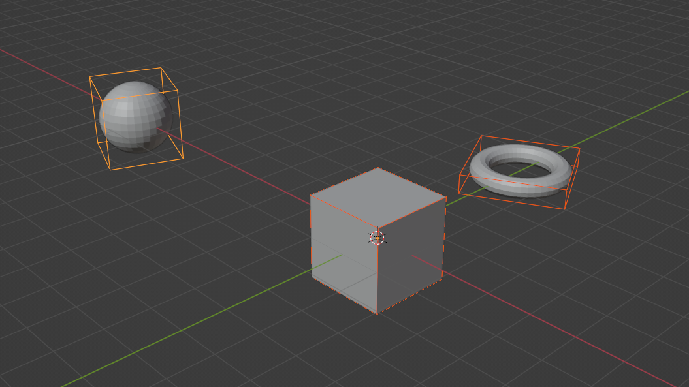
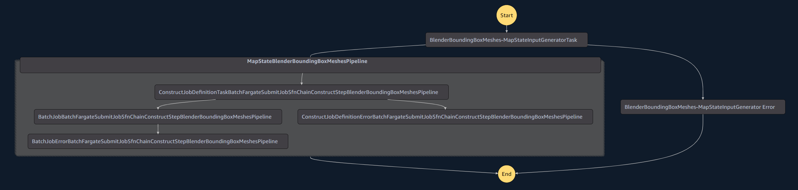

# Blender Bounding Box Mesh - Batch Fargate Parallel Pipeline Use Case

## Description
The Blender Bounding Box Mesh Use Case is a sample stack that implements the [Batch Fargate Parallel Pipeline Pattern](../../../patterns/aws-batch-fargate-parallel-pipeline/README.md). It uses a [Blender container](../container/Dockerfile) that is configured to respond to a job type of `BOUNDINGBOX` by pulling a single .OBJ object from an S3 path, calculating a bounding box for the mesh content in that object, then uploading a .OBJ with bounding box data to S3.

### Example use case: Running a Blender mesh processing script in a parallel.

Input three OBJ files for calculating bounding boxes (*Combination image of all three input meshes.*):


Each bounding box is computed in parallel, and output as a new OBJ file with bounding boxes created (*Combination image of all three output bounding box meshes + input meshes.*):



Parallel Pipeline State Machine Graph:


## Job Schema
The `INPUT_SINGLE_FILE_OUTPUT_PREFIX` job schema from the job-schema-system is used for this use case.

## Usage
1. Deploy the stack in a CDK project. 
2. Once deployed, navigate to the AWS Console S3 page. Find the source asset bucket.
3. Create a folder `input`
4. Upload 1 or many .OBJ files with mesh content to the `input` folder.
5. Navigate to the Step Functions page. 
6. Execute the Step Function with the following input state:
```
{
  "state_machine_global_data": {
    "job_name": "test-map"
  },
  "step_data": {
    "type": "BOUNDINGBOX",
    "source_bucket": <Source_Asset_Bucket_Name>,
    "inputs_prefix": "input",
    "outputs_prefix": "bounding-box"
  }
}
```
7. After execution, navigate to the S3 page.
8. Check the `bounding-box` folder for the output file. The meshes in the .OBJ will have bounding boxes drawn around them.
