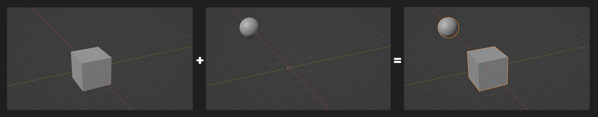

# Blender Join Mesh - Batch Fargate Series Pipeline Use Case

## Description
The Blender Join Mesh Use Case is a sample stack that implements the [Batch Fargate Series Pipeline Pattern](../../../patterns/aws-batch-fargate-series-pipeline/README.md). It uses a [Blender container](../container/Dockerfile) that is configured to respond to a job type of `JOIN` by pulling multiple .OBJ objects from an S3 prefix path, joins all the meshes together into a single mesh, then uploads a .OBJ with to S3. It repeats this process two times to demonstrate the series chaining.

### Example use case: Running a Blender mesh processing script in a series of steps.

**Step 1:** The separate cube and sphere meshes are joined into a new mesh that is uploaded to S3.



**Step 2:** The joined mesh from Step 1 is joined with the separate torus mesh into a new mesh that is uploaded to S3.


Series Pipeline State Machine Graph:


## Job Schema
The [input-output-prefix job schema](../../../constructs/core/job-schemas-lambda-layers/README.md) is used for this use case.

## Usage
1. Deploy the stack in a CDK project. 
2. Once deployed, navigate to the AWS Console S3 page. Find the source asset bucket.
3. Create a folder `input`
4. Upload 2 or many .OBJ files with mesh content to the `input` folder.
5. Navigate to the Step Functions page. 
6. Execute the Step Function with the following input state:
```
{
  "state_machine_global_data": {
    "job_name": "test-series"
  },
  "step_data": {
    "type": "JOIN",
    "step_schema": "input-output-prefix",
    "source_bucket": <Source_Asset_Bucket_Name>,
    "inputs_prefix": "input",
    "outputs_prefix": "step-1"
  }
}
```
7. After execution, navigate to the S3 page.
8. Check the `final-output` folder for the output file. The meshes in the .OBJ will be joined.